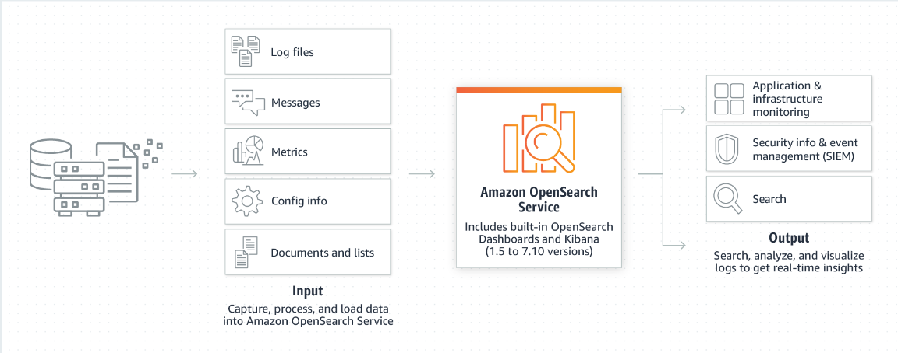
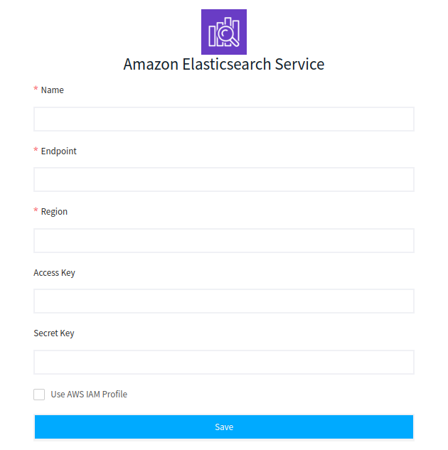

# Amazon Elasticsearch Service

Apica Ascent supports **Amazon Elasticsearch Service** as a Data Source which makes it easy for you to perform interactive log analytics, real-time application monitoring, a website search, and more. OpenSearch is an open-source, distributed search and analytics suite derived from Elasticsearch

Let's see how Amazon Elasticsearch Service works

### Creating and Adding Amazon Elastic Service Data Source

The first step is to add Amazon Elasticsearch Service Data Source to your Apica Ascent. Fill out the below fields while configuring the data source

* **Name**: Name of the data source
* **Endpoint**: The endpoint of the Amazon Elasticsearch Service instance
* **Region**: The region of the Amazon Elasticsearch Service instance
* **Access Key (optional)**: Access Key of the IAM user
* **Secret Key (optional)**: Secret of the IAM user

That's all. The next step is to navigate to the Query editor page and start querying the data
