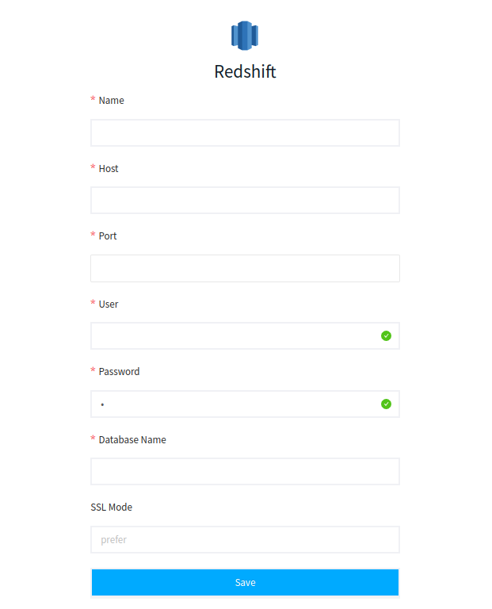

# Amazon Redshift

Apica Ascent helps you to connect to your Redshift Cluster to easily query your data and build dashboards to visualize data easily

The first step is to create a Redshift Cluster, please navigate to get started with Amazon Redshift [https://docs.aws.amazon.com/redshift/latest/gsg/getting-started.html](https://docs.aws.amazon.com/redshift/latest/gsg/getting-started.html)

### Adding Redshift to Apica Ascent

The second step is to create and add Redshift to Apica Ascent and add fill out the below fields and save

* **Name**: Name the data source (e.g. Redshift)
* **Host**: The full URL to your instance
* **Port**: The port of the instance endpoint (e.g. 3306)
* **User**: A user of the instance
* **Password**: The password for the above user
* **Database name**: The name of the virtual database for Redshift (e.g. Redshift1)

That's it. Now navigate the Query editor page and start querying your data
