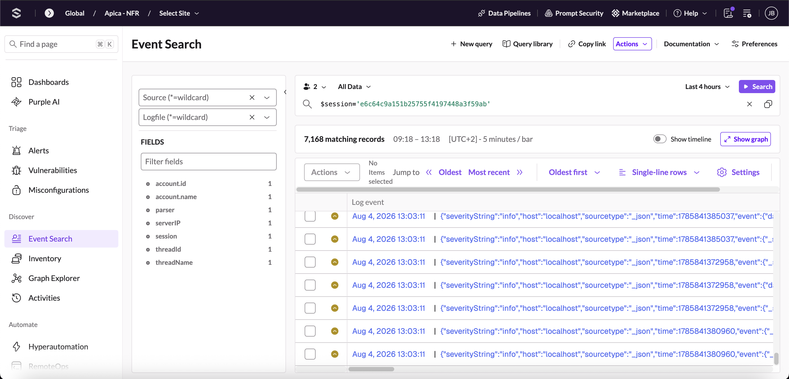
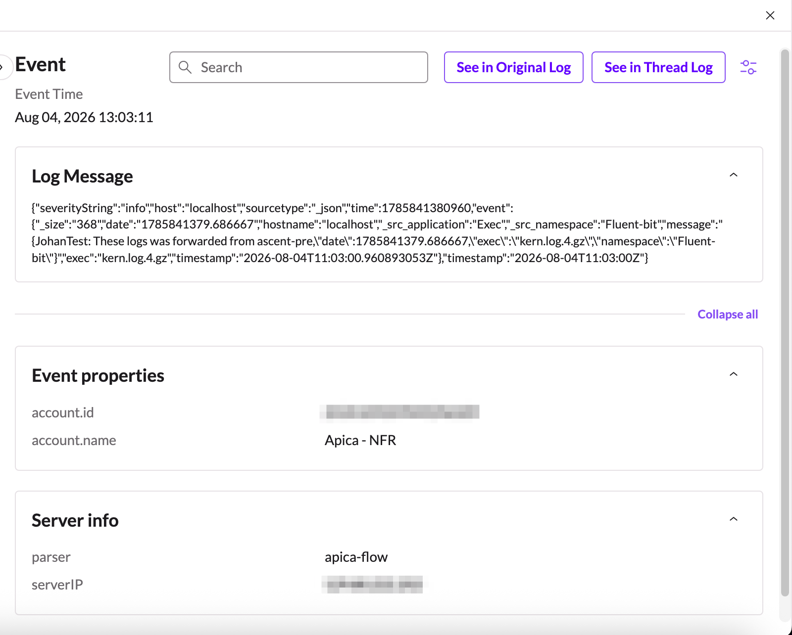

# SentinelOne

Here is the process for forwarding syslog data from Apica Flow to SentinelOne:

### **1. Generate a SentinelOne Event Collector token**

In the SentinelOne console, under Singularity Data Lake, create an HTTP Event Collector source — this issues a bearer token and tells you your ingest region (e.g., `us1`, `eu1`). Note the region; it determines your ingest URL.

### **2. Identify the ingest endpoint**

SentinelOne exposes two HEC paths at `https://ingest.<region>.sentinelone.net`:

* `/services/collector/event` — for structured JSON events (the one to use for Apica-processed telemetry)
* `/services/collector/raw` — for raw/unstructured text (used by integrations like Cloudflare Logpush that ship pre-formatted logs)

For data coming out of Flow, `/services/collector/event` is the right target since Flow is already emitting structured JSON.

### **3. Configure the forwarder in Apica Flow**

Go to Integrations > Forwarders > Add Forwarder > **Javascript Code Forwarder** and point it at SentinelOne:

Replace the TOKEN and REGION values within the following script:

```
for (let event of Events) {
    let cfg = {
        method: "POST",
        headers: {
            "Content-Type": "application/json",
            "Authorization": "Bearer <TOKEN>"
        },
        body: JSON.stringify({ event: event, sourcetype: "apica-flow" }),
    };
    let ret = fetchSync("https://ingest.<REGION>.sentinelone.net/services/collector/event", cfg);
    console.log("Status:", ret.status, "Response:", ret);
}
```

**Configuring the forwarder:**

* For the **JS Code Forwarder** (already generic and open in Flow) pointed at the same `/services/collector/event` URL, explicitly setting `Authorization: Bearer <token>` in the request headers — this guarantees compatibility.

### **4. Tag a source type**

Set a `sourcetype` value (e.g., `apica-flow`) on the outbound events — SentinelOne uses this to route parsing and to make the data findable in the Event Search within the Discover section of SentinelOne.

### **5. Verify**

Send a test batch and confirm the events land in the SentinelOne Discovery view under the configured source type before wiring up production pipelines, similar to the following Event Search results:

<figure><figcaption></figcaption></figure>

By clicking on the actual log from the records list, you will obtain the following details to confirm the data is flowing correctly:

<figure><figcaption></figcaption></figure>

**Note:** this covers Flow → SentinelOne (getting Apica-processed telemetry into the system). Pulling SentinelOne's own EDR alerts _into_ Apica would be a separate, reverse-direction integration against SentinelOne's Management Console API — worth keeping distinct if that's ever needed.
