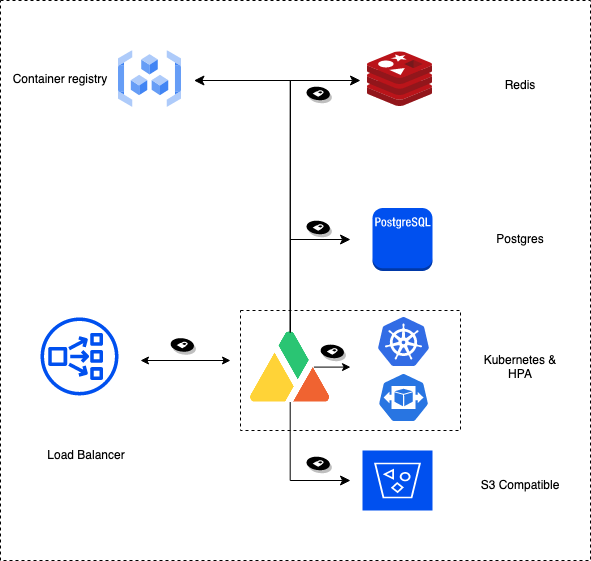
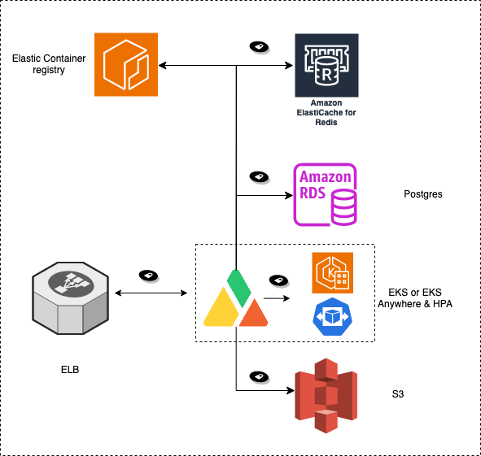
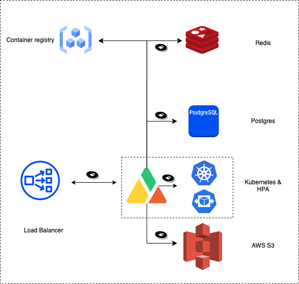

# Architecture and Sizing

## Requirements

A production deployment of  Apica Ascent requires the following key components:

1. **A cloud-based or k0s Kubernetes cluster** to run the Apica Ascent software components.  Apica Ascent OnPrem's non-cloud offering is based on [k0s](https://k0sproject.io/).
2. **An object store** is where the data fabric stores its data at rest. An S3-compatible object store is required.&#x20;
   1. Azure installs can take advantage of a native integration with the Azure Blob store.&#x20;
3. **Access to a container registry** for docker images for the Apica Data Fabric.

Optional External Items

1. **Postgres -** Ascent's internal Postgres can be replaced with a RDS or other managed offerings.
2. **Redis -** Ascent's internal Redis server can be replaced with like managed offerings.

## Sizing

Ascent can be configured to either (a) store indexed data within Lake (using InstaStore technology) for a specific duration, or (b) use "Flow Only" mode and not store any data in Lake. Depending on which option is chosen, the sizing parameters will be quite different.

#### Storing Data in Apica Lake

Ascent stores most customer data in the object store which will scale with usage.  All data will be indexed in the S3-compatible data store, and the k8s cluster has the following minimum requirements.

| Service            | vCPUs | RAM   | Disk  |
| ------------------ | ----- | ----- | ----- |
| Ingest per GB/hour | 1.25  | 3.5GB | 5GB\* |
| Core Components    | 10    | 28GB  | 150GB |

&#x20;\*5GB/ingest pod is the minimum, but 50GB is recommended.

#### Flow Only Mode (No Storing of Data in Apica Lake)

If data will not be retained in Lake, indexing is turned off and the Kubernetes cluster has the following minimum requirements.

| Service            | vCPUs | RAM   | Disk    |
| ------------------ | ----- | ----- | ------- |
| Ingest per GB/hour | 0.5   | 1.5GB | 5GB\*\* |
| Core Components    | 4     | 12GB  | 20GB    |

&#x20;\*\*5 GB/ingest pod is the minimum, but a small S3-compatible data store is still needed for alerts and journals from the platform.

## Packaging

The deployment of Ascent is driven via a Helm chart (labelled "apica-data-fabric").

```
helm install apica --namespace apica-data-fabric apica-repo/apica 
```

The typical method of customizing the deployment is done with a `values.yaml` file as a parameter to the Helm software when installing the Apica Data Fabric Helm Chart.&#x20;

```
helm install apica --namespace apica-data-fabric apica-repo/apica -f values.yaml
```

***

## Reference Kubernetes Deployment Architecture

<div data-full-width="false"><figure><figcaption></figcaption></figure></div>

***

## Reference AWS Deployment Architecture

<figure><figcaption></figcaption></figure>

***

## Reference Hybrid Deployment Architecture

The reference deployment architecture shows a hybrid deployment strategy where the Apica stack is deployed in an on-prem Kubernetes cluster but the storage is hosted in AWS S3. There could be additional variants of this where services such as Postgres, Redis, and Container registry could be in the cloud as well.

<figure><figcaption></figcaption></figure>

&#x20;
