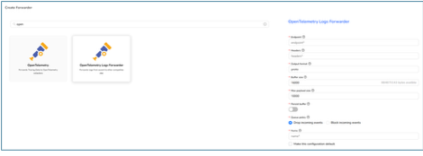

# Fluent-bit CPU Plugin

### How to Integrate Fluent-bit CPU Plugin with Apica Ascent

#### 1. Introduction

This guide explains how to send CPU metrics to Apica Ascent with Fluent-bit, and how to view them.

#### 2. Configure the CPU Plugin in Fluent-bit

Update your Fluent-bit.conf with an input and filter for the CPU Plugin:

```
[INPUT]
    Name cpu
    Tag  cpu
```

```
[FILTER]
    Name   modify
    Match  cpu
    Add    namespace Fluent-bit
    Add    app_name CPU
 
```

Restart Fluent-bit with `systemctl restart fluent-bit` and check the status with `systemctl status fluent-bit` to verify that it’s running correctly.

Helpful links:

* [Official Plugin documentation.](https://docs.fluentbit.io/manual/data-pipeline/inputs/cpu-metrics)
* [Set up Fluent-bit for Apica Ascent.](https://docs.apica.io/integrations/list-of-integrations/fluent-bit#fluent-bit-configuration)

#### 3. Verify Logs in Apica Ascent

1\.     Log in to Apica Ascent

2\.     Navigate to Explore → Logs & Insights

3\.     Look for the namespace and application name specified in the config file<br>

Example:

<figure><figcaption></figcaption></figure>

#### 4. Example logs

Message:


```
{"app_name":"CPU","cpu0.p_cpu":886,"cpu0.p_system":619,"cpu0.p_user":267,"cpu1.p_cpu":870,"cpu1.p_system":595,"cpu1.p_user":275,"cpu_p":877,"date":1764584815.196833,"namespace":"Fluent-bit","system_p":606.5,"user_p":270.5}
```


StructuredData :

```
_size: 222
cpu0.p_cpu: 886
cpu0.p_system: 619
cpu0.p_user: 267
cpu1.p_cpu: 870
cpu1.p_system: 595
cpu1.p_user: 275
cpu_p: 877
date: 1764584815.196833
system_p: 606.5
user_p: 270.5
```

#### 5. Troubleshooting

&#x20; [**Fluent-bit Troubleshooting**](https://docs.apica.io/integrations/list-of-integrations/fluent-bit/fluent-bit-troubleshooting)
