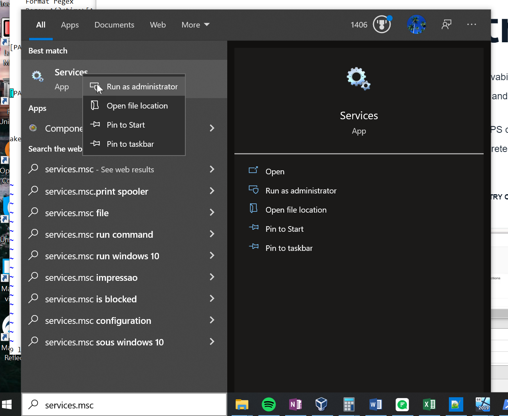
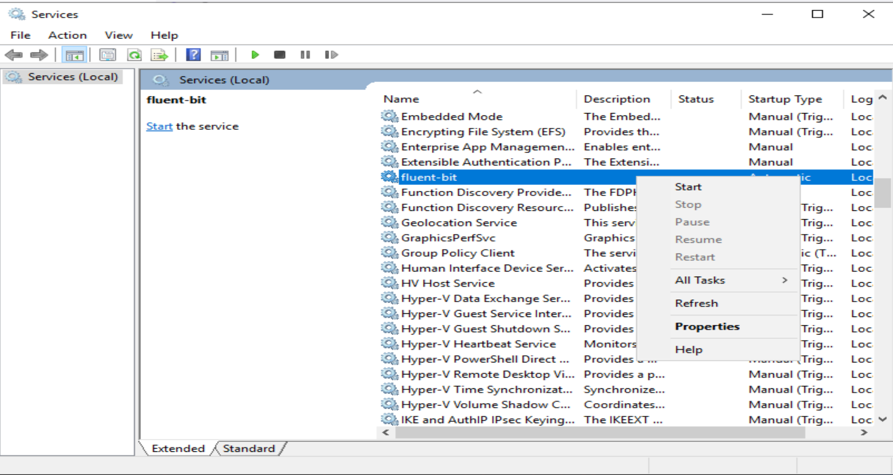

# IIS Logs on Windows

## Create IIS Config for fluent-bit

You can download an example configuration for IIS below. Please make sure to edit the config so the correct host and token are provided. Also if your IIS service is generating logs to a different path, please make sure to edit the path where the logs are located as well.

Also, make sure to edit the _parsers.conf_ path to the folder where you installed your fluent-bit agent.

```
[SERVICE]
    Parsers_file  C:\test\td-agent-bit-1.8.6-win64\conf\parsers.conf
    Log_Level error

[INPUT]
    Name              tail
    Parser            iis
    Path              C:\\inetpub\logs\\LogFiles\\W3SVC1\\u_ex*.log
    Path_Key          On
    Tag               logiq
    Buffer_Max_Size   1024k
    Read_from_Head    On

[FILTER]
    Name          record_modifier
    Match         logiq
    Record cluster_id iiscluster
    Record namespace iisnamespace
    Record app_name  iisappname
    Record hostname  iishostname

[OUTPUT]
    Name          http
    Match         *
    Host          <host>
    Port          443
    URI           /v1/json_batch
    Format        json
    tls           on
    tls.verify    off
    net.keepalive off
    compress      gzip
    Header Authorization Bearer <Ingest token>
```

### IIS parsers.conf

```
[PARSER]
    # http://rubular.com/r/tjUt3Awgg4
    Name iis
    Format regex
    Regex ^(?<timestamp>\d{4}-\d{2}-\d{2} \d{2}:\d{2}:[\d\.]+) (?<message>.*)$|^(?<raw_message>.*)$
    Time_Key    timestamp
    Time_Keep   On
    Time_Format %Y-%m-%d %H:%M:%S
```

## Multiple Source Fluent-bit Configuration

Fluent-bit service can gather data sources from multiple locations such as log files from a different directory. There can be multiple \[INPUT] and \[FILTER] section blocks within a td-fluent.conf file and each \[INPUT] and \[FILTER] block is linked via _\[INPUT] Tag_ and _\[FILTER] Matching_ pairs. Below shows an example partial configuration file.

```


...

[INPUT]
    Name              tail
    Parser            iis
    Path              C:\\inetpub\logs\\LogFiles\\W3SVC1\\u_ex1311.log
    Path_Key          On
    Tag               logiq1
    Buffer_Max_Size   1024k
    Read_from_Head    On

[INPUT]
    Name              tail
    Parser            iis
    Path              C:\\inetpub\logs\\LogFiles\\W3SVC1\\u_ex1312.log
    Path_Key          On
    Tag               logiq2
    Buffer_Max_Size   1024k
    Read_from_Head    On

[FILTER]
    Name          record_modifier
    Match         logiq1
    Record cluster_id iiscluster1
    Record namespace iisnamespace1
    Record app_name  iisappname1
    Record hostname  iishostname1

[FILTER]
    Name          record_modifier
    Match         logiq2
    Record cluster_id iiscluster2
    Record namespace iisnamespace2
    Record app_name  iisappname2
    Record hostname  iishostname2

....


```

## Install and Enable Windows Fluent-bit Service

Follow the steps in Installing[ <mark style="color:blue;">fluent-bit for windows</mark>](https://docs.logiq.ai/integrations/fluent-bit#fluent-bit-for-windows) to setup your fluent-bit agent and service. Use the modified config file above to match your environment during the setup process.

Fluent-bit service will automatically be started upon the end of the script installation. However, one can use Windows service management tool to control its state. Below show how to start the Windows service tool GUI.



After the Windows Service tool got enabled, one can scroll the service list to Fluent-bit service and right-click the mouse to change the Fluent-bit Start/Stop/Restart state; see below.



## Example Ingested IIS Logs


