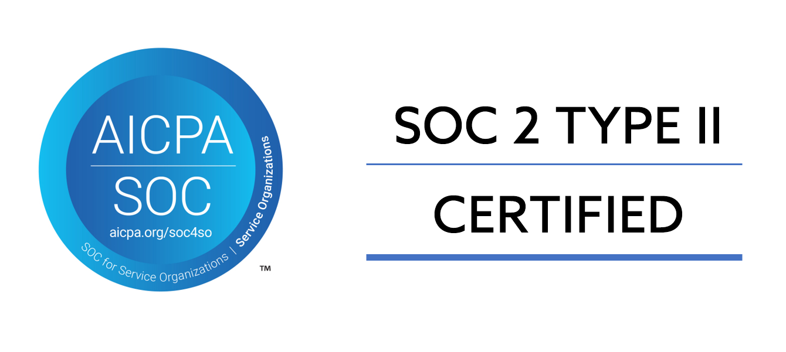
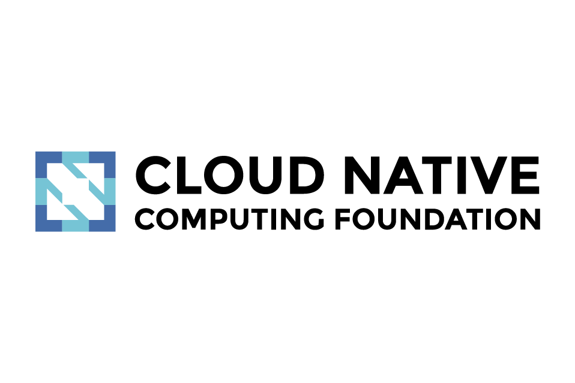

# Ascent Overview

## Welcome to the Apica Ascent Product Suite

Apica Ascent is a suite of products that includes a powerful full-stack Telemetry Data Management and Observability platform designed to streamline and optimize your entire data life-cycle: **Collect**, **Control**, **Store**, and **Observe**.

### Data Management powered by InstaStoreTM

Apica Ascent uses a patented storage engine : InstaStore for all it's data persistence. InstaStore provides unique benefits due to it's architecture using object storage as the underlying storage layer. You can read more on the InstaStore [here](../lake/lake-powered-by-instastore-tm.md).

### Observability Data Lifecycle

The **Apica Ascent product suite** consolidates observability data into a single platform, focusing on **(M)etrics, (E)vents, (L)ogs, and (T)races**, commonly known as **MELT** data. This integrated approach to MELT data is crucial for efficient root cause analysis. For example, if you encounter an API performance issue represented by latency metrics, being able to drill down to the API trace and accompanying logs becomes critical for faster root cause identification. Unlike traditional observability implementations, where data sits in separate silos that don't communicate, Apica Ascent ensures a cohesive view of all MELT data, leading to faster root cause outcomes.

This makes the **Ascent product suite** a reliable first-mile solution for consolidating **MELT** data within your enterprise environments. Experience a seamless, fully integrated observability solution that enhances performance and efficiency across your infrastructure.

<figure><figcaption></figcaption></figure>

### Core Products and Capabilities

#### Apica Ascent — Comprehensive Data Collection

Apica Ascent seamlessly bridges traditional, on-premises, and modern cloud-native data sources, ingesting security and observability data from every agent, protocol, and platform with a unique control plane, giving full pipeline control without ripping and replacing what already works.

<figure><figcaption></figcaption></figure>

#### Apica Flow — Intelligent Telemetry Pipeline

Apica Flow is the strategic core of the Ascent platform. Flow is an OpenTelemetry-native pipeline built on a “Never Block, Never Drop” architecture — intercepting metrics, events, logs, and traces in motion before they reach downstream storage, Observability platform, or SIEM.

<figure><figcaption></figcaption></figure>

#### Apica Vanguard — AI Synthetic Monitoring

Vanguard extends traditional synthetic monitoring to validate AI agent workflows and agentic system behavior — a category that did not exist two years ago and that no major security vendor currently addresses.

<figure><figcaption></figcaption></figure>

#### Apica Lake with InstaStore™

The storage and retention layer of the Ascent platform, powered by InstaStore™ — Apica’s patented single-tier storage technology. Lake solves the retention cost problem that forces enterprises to choose between data availability and budget.

<figure><figcaption></figcaption></figure>

#### Apica Forge - Time-Series Database

Apica Forge is a distributed time-series database engineered for the extreme cardinality demands of modern cloud-native and agentic AI environments, purpose-built for tag-first indexing, histogram-native storage, and distributed high availability. Currently a standalone offer, Forge is loosely coupled with Ascent today, with a roadmap plan for tight integration as a ‘drop-in’ Prometheus replacement.

<figure><figcaption></figcaption></figure>

#### Apica Observe — AI-Driven Observability Analytics

The analytics and visualization layer of the Ascent platform — providing AI-driven correlation across logs, metrics, traces, and events. Observe is where telemetry becomes intelligence.

<figure><figcaption></figcaption></figure>

### Communities and Compliance

Apica Ascent takes pride in its commitment to security and compliance. The platform adheres to SOC 2 Type II Compliance standards and is an esteemed member of the Cloud Native Computing Foundation (CNCF).

|                                  |                                           |                                                                            |
| -------------------------------- | ----------------------------------------- | -------------------------------------------------------------------------- |
|  |  |  |
