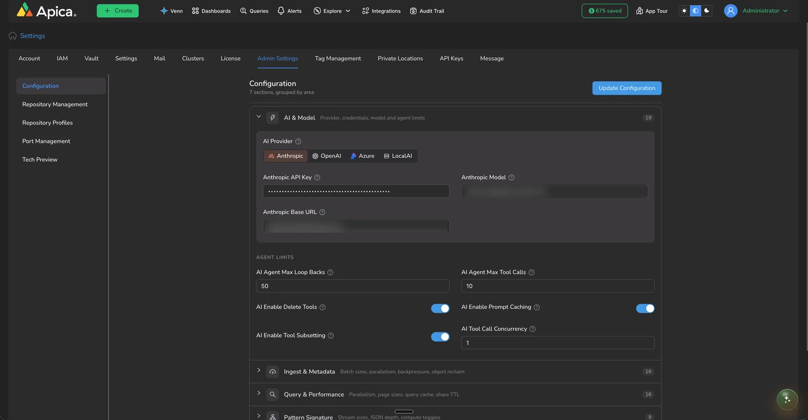

# Administer Venn

Venn's intelligence layer is configurable per deployment. Administrators manage it in **Settings > Admin Settings > Configuration**, in the **AI & Model** section. Changes take effect as soon as you click **Update Configuration**: the next message Venn handles uses the new settings, with no restart or redeploy.

### Choose a provider

| Provider                  | What to configure                                                                                                                          |
| ------------------------- | ------------------------------------------------------------------------------------------------------------------------------------------ |
| **Anthropic**             | API key, model, and optionally a base URL override for proxies or gateways                                                                 |
| **OpenAI**                | API key, model, and optionally a base URL override for OpenAI-compatible proxies or gateways                                               |
| **Azure**                 | API key, endpoint, and deployment name                                                                                                     |
| **LocalAI** (self-hosted) | Base URL of your own OpenAI-compatible endpoint (for example a LocalAI or vLLM deployment inside your network), model, and an optional key |

Because the provider, key, model, and endpoint are all yours, Venn fits deployments where data governance matters: point it at your organization's approved AI endpoint, or at a model that never leaves your infrastructure.

API keys are stored as secrets: once saved, they are shown masked and are never sent back in full. Rotate a key by pasting a new value and clicking **Update Configuration**.

### Agent limits and switches

The same section tunes how Venn's agent behaves:

| Setting                       | Default         | What it does                                                                                                                                                                                                                                              |
| ----------------------------- | --------------- | --------------------------------------------------------------------------------------------------------------------------------------------------------------------------------------------------------------------------------------------------------- |
| **AI Agent Max Tool Calls**   | 10              | Tool-call budget for a normal request. Pipeline-rule builds get a higher internal budget automatically.                                                                                                                                                   |
| **AI Agent Max Loop Backs**   | 50              | Maximum reasoning iterations per message.                                                                                                                                                                                                                 |
| **AI Enable Prompt Caching**  | On              | Anthropic prompt caching, reducing cost and latency on repeated context.                                                                                                                                                                                  |
| **AI Enable Tool Subsetting** | On              | Loads only the relevant pipeline-rule builder tools each turn. Acts as a runtime kill switch: turning it off loads all rule tools every turn.                                                                                                             |
| **AI Enable Delete Tools**    | **Off**         | Delete is not a default capability. Only when this is on can Venn (and external MCP clients) delete resources at all, and every delete still requires explicit user confirmation. Toggling takes effect immediately, including for connected MCP clients. |
| **AI Tool Call Concurrency**  | 1 (recommended) | Tool calls per turn executed in parallel. 1 is sequential and safest; raising it (for example to 6) speeds up multi-rule pipeline builds.                                                                                                                 |

### Notes for administrators

* **Permissions**: Venn executes with the asking user's permissions. Managing who can do what is normal [access management](../admin/access-management/), not a separate AI permission system.
* **Usage metering**: each conversation records tokens and model cost per turn, so AI spend is observable per deployment.
* **Scope**: Venn only answers observability and Ascent questions, refuses to reveal its own configuration or credentials, and never accepts secrets typed into the chat.
