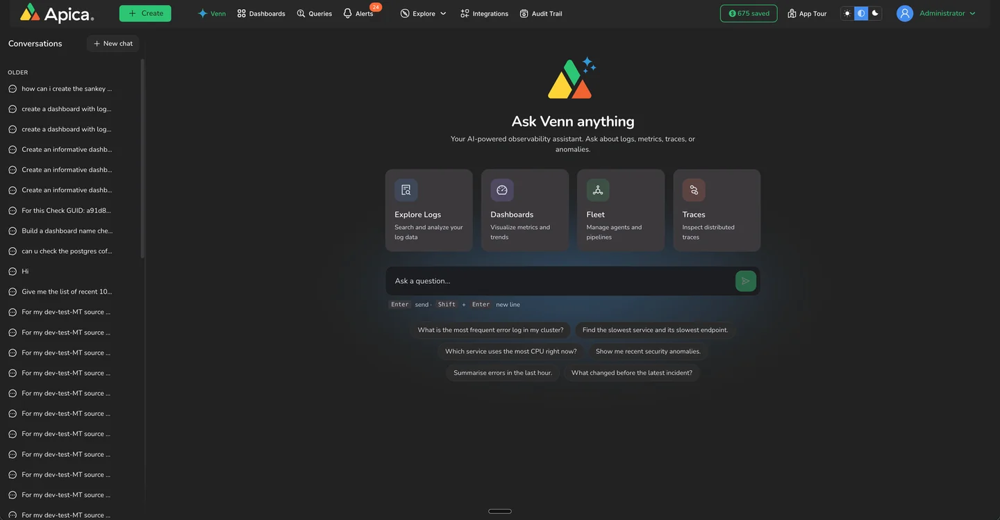

# Getting Started with Venn

Venn is available on almost every page of Ascent. You never need to go looking for it.

### Three ways to open Venn

* **Floating bubble**: click the bubble in the corner of any page (tooltip **"Ask Venn"**). It opens the Venn drawer.
* **Drawer**: a panel slides in from the right, titled **Venn**. You can pin it, widen it, start a **New chat**, or close it. The drawer stays with you as you navigate, and it is aware of the page you are on.
* **Full page**: choose **Venn** from the top navbar, or simply log in: the full-page chat at `/venn` is the default landing page. It shows **"Ask Venn anything"**, starter prompts, and your conversation history.

<figure><figcaption>
The "Ask Venn" bubble
</figcaption></figure>

<figure><figcaption>
The Venn drawer's empty state
</figcaption></figure>

Type your question and press **Enter** to send (**Shift+Enter** for a new line).

### Your first prompts

Good first questions to get a feel for Venn:

* _"What namespaces am I ingesting data from?"_
* _"Show me errors from the last hour"_
* _"Which dataflows have the most errors in the last 24 hours?"_
* _"How do I set up a Kafka source?"_ (Venn answers how-to questions from the Apica documentation, inline in the chat)
* _"Help me cut log volume from my noisiest app using telemetry pipelines"_

### Conversations

* Every chat is saved under **Conversations** on the full-page view, so you can return to and continue past conversations.
* Switching to another chat does not stop Venn: an in-flight answer keeps generating in the background, and results such as pipeline Review cards stay usable when you come back.
* After many answers Venn offers follow-up suggestions as clickable buttons. Clicking one sends it as your next message; you can always type your own instead.

### First-time setup: connect an AI provider (admins)

Venn needs an AI provider before it can answer. An administrator sets this up once, in **Settings > Admin Settings > Configuration**, under the **AI & Model** section:

1. Pick the **AI Provider**: **Anthropic**, **OpenAI**, **Azure**, or **LocalAI** (a self-hosted OpenAI-compatible endpoint).
2. Enter the provider's **API key** and **model** (plus endpoint or base URL where applicable). Keys are stored as secrets and shown masked once saved.
3. Click **Update Configuration**. Changes apply immediately: the next message Venn handles uses the new provider. No restart is needed.

The same section also holds Venn's agent limits and switches (tool-call budgets, prompt caching, delete-tool enablement). See Administer Venn for the full reference.

### What Venn will and will not do

Venn is an observability assistant, and it stays one:

* It answers questions about your logs, metrics, checks, dataflows, and about the Ascent product itself.
* It declines requests outside that scope (general knowledge, politics, unrelated coding tasks, legal or medical advice) and steers back to your data.
* It drafts things for you to review; it does not save or delete anything without your explicit approval. See Safety and control.
